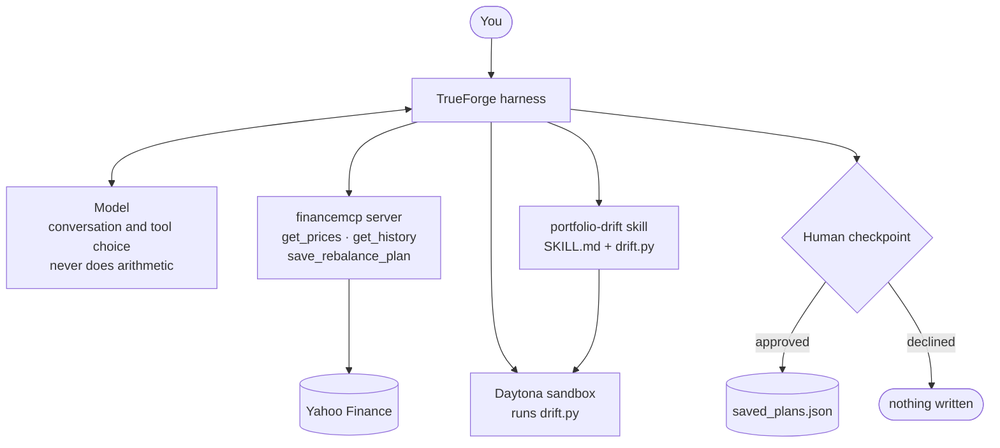

# Portfolio Desk

An agent that measures an investment portfolio against its target allocation,
computes how far each holding has drifted, and proposes the trades that would
bring it back into line — then stops and waits for a human before saving
anything.

Built on [TrueForge](https://trueforge.dev) for the
[WeMakeDevs Agent Harness Hackathon](https://www.wemakedevs.org/hackathons/trueforge).

**Demo:** [[YOUR_YOUTUBE_LINK](https://youtu.be/gMGD-KzywI0)]

---

## The problem

If you invest across several funds, you pick an allocation — say 50% US
stocks, 25% international, 21% bonds, 4% property. Prices then move at
different rates, and your actual mix drifts away from the plan you chose.

Correcting it means pulling current prices, computing each holding's weight,
deciding which have moved far enough to be worth acting on, and sizing trades
against the cash you have. Most people do this in a spreadsheet, or pay a
robo-advisor to do it for them.

This does the calculation properly and leaves the decision to you. It uses
public market data and an arbitrary capital figure — no brokerage
credentials — and it cannot place trades.

## The idea

**The model orchestrates. The sandbox computes. The human decides.**

Language models are unreliable at arithmetic and their mistakes are silent. So
the model here never calculates anything. It reads what you typed, decides
which tools to call, and explains what comes back. Every number in the output
traces to either the market data server or `drift.py`.

That boundary is the whole design, and it is why this needs a harness rather
than a loop around an API call.

## Architecture



```mermaid
sequenceDiagram
    actor You
    participant Agent
    participant Skill as portfolio-drift skill
    participant Market as financemcp
    participant Box as Sandbox

    You->>Agent: holdings, target allocation, cash
    Agent->>Skill: load policy
    Agent-->>You: does the cash count toward the allocation?
    You-->>Agent: yes, deploy it
    Agent->>Market: get_prices for all tickers (one call)
    Market-->>Agent: prices and timestamp
    Agent->>Box: run drift.py with holdings and prices
    Box-->>Agent: drift, breaches, trades, warnings
    Agent-->>You: trade list — awaiting approval
    You-->>Agent: approved
    Agent->>Market: save_rebalance_plan
```

A single run: the model reads your holdings and target, calls `get_prices` for
all tickers in one batch, loads the skill, runs `drift.py` in the sandbox with
the prices and holdings as JSON, reads the result, presents the trade list —
and stops.

`save_rebalance_plan` is the only tool that writes. The other two are
read-only, which is why it is the only one that needs a person.

## What's in here

| Path | What it is |
|---|---|
| `market_data_server.py` | MCP server. Batched prices and history from yfinance, plus plan storage. |
| `skills/portfolio-drift/SKILL.md` | The policy the agent follows. Instructions, not documentation. |
| `skills/portfolio-drift/drift.py` | The calculation. Stdlib-only, deterministic, JSON in / JSON out. |
| `sample.json` | A worked example you can pipe into `drift.py`. |
| `NOTES.md` | Build log — what broke and why. |

## Running it

Requires Node 22+, Python 3.10+, a model API key, and a
[Daytona](https://daytona.io) key for the sandbox.

**1. Start the MCP server**

```bash
pip install -r requirements.txt
python market_data_server.py          # http://localhost:8000/mcp
```

**2. Start TrueForge**

```bash
npx @truefoundry/trueforge            # http://localhost:8790
```

**3. Wire it up in the TrueForge UI**

- Settings → Models — add a provider and key
- Settings → Connectors — add by URL: `http://localhost:8000/mcp`
- Settings → Skills — Import from GitHub, pointing at this repo
- Settings → Sandbox providers — add your Daytona key

**4. Enable the connector, skill, and sandbox in the chat, then ask**

```
I hold 48 shares of VTI, 62 VXUS, 135 BND, 9 VNQ, plus $3000 cash.
Target is 50/25/21/4. Check my drift and save the plan.
```

**Trying `drift.py` on its own**, without the harness:

```bash
python3 skills/portfolio-drift/drift.py < sample.json
```

## The rebalancing policy

A holding breaches when it drifts more than 5 percentage points from target,
**or** more than 25% of its own target weight — whichever binds first. This is
the 5/25 rule.

The relative band is the part that earns its place. From a real run:

| Holding | Target | Drift | Breached |
|---|---|---|---|
| VTI | 50% | −1.15 pp | no |
| VNQ | 4% | −1.65 pp | **yes** |

Almost identical movement, opposite verdicts. VNQ's target is only 4%, so 25%
of it is one percentage point — a much tighter leash than a flat 5-point
threshold, which would have missed the drift entirely. A small sleeve can be
nearly wiped out while barely moving the headline number.

The output also warns when purchases depend on money that hasn't settled yet:

> Buys of 4,813.68 exceed cash of 3,000.00; 1,813.68 must come from sale
> proceeds, which do not settle immediately.

## Qodo Code Review Evidence

Every substantive change went through a pull request reviewed by Qodo before
merge.

**Representative merged PR:** [[YOUR_PR_LINK](https://github.com/yashpj/Harmness)]

Qodo surfaced nine findings across the MCP server and the drift calculator.
All were legitimate; eight were fixed and one was dismissed with reasoning in
the thread.

The most valuable was a correctness bug in `drift.py`. Holdings absent from
the target allocation were excluded from the calculation entirely, so a
portfolio half-invested in an off-policy asset reported as perfectly on target
with no rebalance required — the one holding a rebalance should obviously
flag was the one that silently vanished. Untracked holdings now carry an
implicit zero target and are sized for full sale.

Four findings shared a root cause I hadn't spotted: I had written type checks
everywhere and finiteness checks nowhere, so NaN and infinity passed
validation. Worse, `NaN < 0` evaluates to False, so even the target-sum check
failed open. One helper function closed all four. Qodo also caught that
turnover was understated when cash funded the trades, and that the
insufficient-cash warning compared net rather than gross buys — missing the
ordinary case where a sale funds a purchase.

**Dismissed with reasoning:** Qodo flagged serial upstream fetches as a
performance problem. Batching in this project refers to the MCP call boundary,
where each call costs a model round-trip; upstream calls stay serial so that a
single bad ticker produces a per-symbol error instead of failing the whole
batch. The misleading comment was clarified rather than the behaviour changed.

The pattern across most findings: the caller of an MCP server is a language
model assembling JSON from a conversation, so malformed input isn't an edge
case. I had trusted that caller too much.

## Known limitations

- **Skill invocation is not fully reliable.** The agent sometimes writes its
  own equivalent arithmetic instead of running `drift.py`, especially without
  explicit instruction. The deterministic script is the intended path;
  enforcing it consistently is the next piece of work.
- **The approval gate is instruction-based**, not enforced by the runtime. The
  agent is instructed to present the trade list and wait for confirmation
  before calling `save_rebalance_plan`. A runtime-level checkpoint would be
  stronger.
- **yfinance is unofficial and delayed.** Prices are typically 15 minutes
  behind and Yahoo can change its endpoints without notice.
- **Analysis, not advice.** The output is a set of candidate trades for a
  person to review. Nothing here connects to a brokerage.

## What I learned

Written up in `NOTES.md`. The short version:

Gemini 3 returns a `thought_signature` that must be replayed on the following
request. Standard OpenAI-compatible clients drop unknown fields when rebuilding
history, so tool calls fail with a 400 while plain chat works fine — the same
bug filed against VS Code Copilot, OpenAI Codex, and Open WebUI.
"OpenAI-compatible" is a leaky abstraction, and it leaks specifically on agent
loops, because only agent loops replay assistant history.

TrueForge's Code Mode inverts the usual cost model. Native tool calling spends
one model round-trip per tool; Code Mode lets the agent call several tools from
inside one sandbox script, for one turn total. On a constrained rate limit that
is the difference between a run that finishes and a run that doesn't.

And an agent given two routes to the same goal will sometimes take the worse
one. Constraining the toolset beats prompting harder.